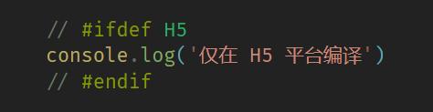
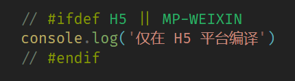
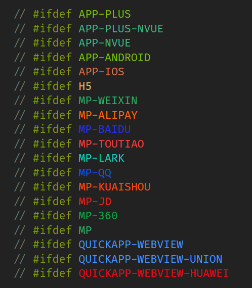
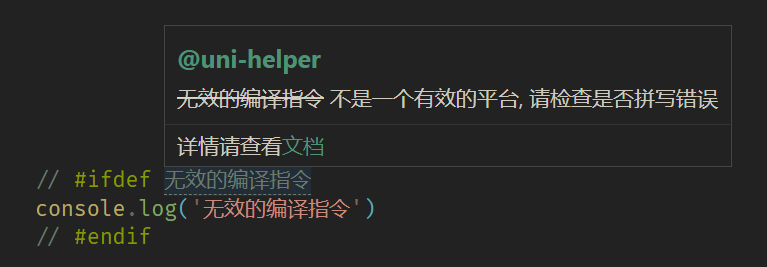
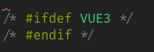
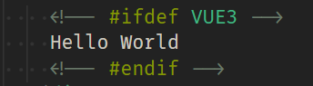

<h1 align="center">uni-helper/uni-highlight-vscode</h1>

## VScode条件编译语法高亮支持
在`VScode`中对条件编译的代码注释部分提供了语法高亮，可分辨出写法是否正确，使得代码更加清晰

***

### 基础使用

***

### 多平台高亮

***
### 各平台多种颜色高亮

***

### 错误提示

***

### css高亮

***

### html高亮

