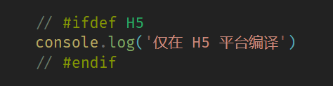
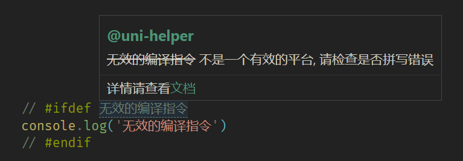
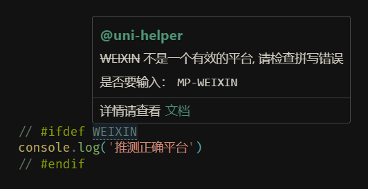
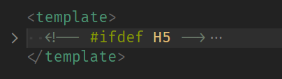
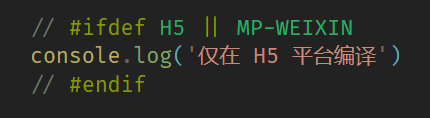
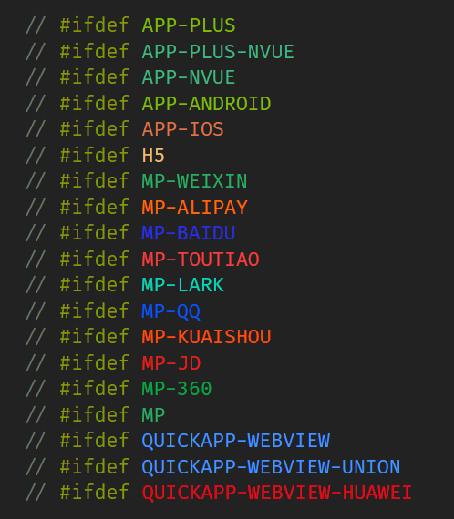
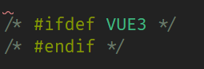
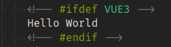

# @uni-helper/uni-highlight-vscode

<p align="center">
  
</p>

<p align="center">
  <a href="https://github.com/uni-helper/uni-highlight-vscode/blob/main/LICENSE"></a>
  <a href="https://github.com/uni-helper/uni-highlight-vscode/stargazers"></a>
  <a href="https://marketplace.visualstudio.com/items?itemName=uni-helper.uni-highlight-vscode"></a>
  <a href="https://marketplace.visualstudio.com/items?itemName=uni-helper.uni-highlight-vscode"></a>
</p>
<p align="center">
  <a href="https://github.com/FliPPeDround"></a>
</p>

在 VS Code 中为 [uni-app](https://uniapp.dcloud.net.cn/) 条件编译的代码注释提供语法高亮、错误提示和折叠功能。

> **请考虑持续[赞助](https://afdian.com/a/flippedround)以维持该项目的持续健康发展，非常感谢！🙏**

想让 `uni-app` 开发变得更直观、高效？想要更好的 `uni-app` 开发体验？不妨看看 [uni-helper 主页](https://uni-helper.js.org) 和 [uni-helper GitHub Organization](https://github.com/uni-helper)！

## 插件特性

- 条件编译注释语法高亮，多平台分色显示
- 未知平台错误提示，并推测最接近的正确写法
- 条件编译注释块折叠，支持一键折叠其他平台
- 支持 Vue、JS、TS、CSS、HTML 等多种文件类型

### 基础使用



### 错误提示



### 错误推测



### 注释块折叠



### 多平台高亮



### 各平台多种颜色高亮



### CSS 高亮



### HTML 高亮



## 扩展设置

|设置|类型|默认值|说明|
|-|-|-|-|
|`uni-highlight.platform`|`object`|`{}`|自定义平台高亮和名称，可覆盖内置平台的颜色、标签，或添加新平台|

在 `.vscode/settings.json` 中配置，值可以直接写颜色：

```json
{
  "uni-highlight.platform": {
    "MP-DINGTALK": "#41b883"
  }
}
```

也可以带上平台说明：

```json
{
  "uni-highlight.platform": {
    "MP-DINGTALK": {
      "color": "#41b883",
      "label": "钉钉"
    }
  }
}
```

修改设置后需要重载窗口（`Developer: Reload Window`）才会生效。

### 内置平台

内置以下 27 个平台，平台列就是条件编译注释里写的名字，标签是悬停提示里显示的名称：

|平台|标签|颜色|
|-|-|-|
|`VUE3`|Vue 3|`#41b883`|
|`VUE2`|Vue 2|`#41b883`|
|`UNI-APP-X`|Uni-App X|`#2b9939`|
|`APP`|App|`#80bd00`|
|`APP-PLUS`|App Plus|`#80bd00`|
|`APP-PLUS-NVUE`|App Plus NVue|`#41b883`|
|`APP-NVUE`|App NVue|`#41b883`|
|`APP-ANDROID`|App Android 平台|`#80bd00`|
|`APP-IOS`|App iOS 平台|`#d9774b`|
|`APP-HARMONY`|App HarmonyOS Next 平台|`#0a59f7`|
|`H5`|H5|`#e5c07b`|
|`WEB`|Web|`#e5c07b`|
|`MP-WEIXIN`|微信小程序|`#2aae67`|
|`MP-ALIPAY`|支付宝小程序|`#ff6a00`|
|`MP-BAIDU`|百度小程序|`#2932e1`|
|`MP-TOUTIAO`|抖音/字节跳动小程序|`#f04142`|
|`MP-LARK`|飞书小程序|`#00d6b9`|
|`MP-QQ`|QQ小程序|`#025aef`|
|`MP-KUAISHOU`|快手小程序|`#ff5005`|
|`MP-JD`|京东小程序|`#e21e17`|
|`MP-360`|360小程序|`#00aa48`|
|`MP-HARMONY`|鸿蒙元服务|`#0a59f7`|
|`MP-XHS`|小红书小程序|`#ff2442`|
|`MP`|小程序/鸿蒙元服务|`#2aae67`|
|`QUICKAPP-WEBVIEW`|快应用 WebView|`#4497ff`|
|`QUICKAPP-WEBVIEW-UNION`|快应用 WebView 联合|`#4497ff`|
|`QUICKAPP-WEBVIEW-HUAWEI`|快应用 WebView 华为|`#e60214`|

## 命令

|命令|标题|说明|
|-|-|-|
|`uni.comment.reload`|Uni Helper: 重新加载条件编译高亮|重新扫描当前文件的条件编译注释，刷新高亮和折叠|
|`uni.comment.fold-other-platform`|Uni Helper: 选择平台并折叠其他平台注释|选择一个平台，折叠其余平台的注释块；检测到条件编译注释时，编辑器标题栏会显示对应按钮|

## 参与贡献

欢迎通过 Issue 或 Pull Request 参与改进本项目。开始前请阅读 [CONTRIBUTING.md](./CONTRIBUTING.md)，了解项目结构、本地开发流程、测试方式与提交规范。

## 许可证

[MIT](https://github.com/uni-helper/uni-highlight-vscode/blob/main/LICENSE) © 2022-present [uni-helper](https://github.com/uni-helper) & Collaborators
